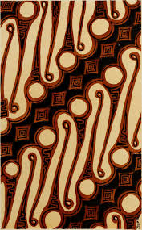
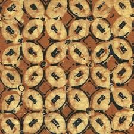
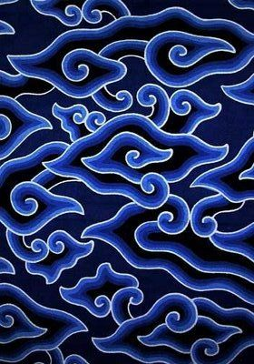
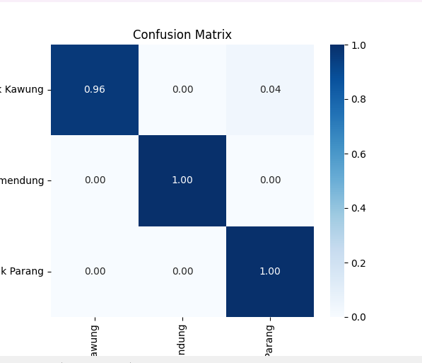

# Batik Detector Web App

### About the Project
Batik is an Indonesian craft which uses wax-resistant dyes to fabric in order to create beautifully intricate patterns.  With about 5.849 batik motifs in Indonesia as of today, Indonesian batik has been recognized in the UNESCO's Intangible Cultural Heritage of Humanity List since 2009. 

This web app detects batik patterns from images uploaded on the website and classifies the batik pattern. Currently, the web app is trained on a dataset of three well-known batik motifs: Batik Megamendung, Batik Kawung, and Batik Parang, all carrying significant meaning and culture behind its patterns. 

*Batik Parang*

*Batik Kawung*

*Batik Megamendung*

### Model Architecture
The dataset was trained on MobileNetV2, a light CNN model provided by Tensorflow.
- **Base Model:** MobileNetV2 (pre-trained on ImageNet)
- **Custom Layers:** 
  - GlobalAveragePooling2D
  - Dense(128, activation='relu')
  - Dropout(0.5)
  - Dense(3) output layer
- **Input Size:** 224×224×3
- **Loss Function:** Sparse Categorical Crossentropy (from logits)
- **Optimizer:** Adam (learning rate: 0.001)

The following is the confusion matrix for the test dataset consisting of 3 batik patterns: 

### Under Construction: 

- Grad-CAM implementation for pattern identification
- Development of the web app's front end
- Addition of more batik patterns (there are literally 5.849 of them)

## Acknowledgments

- Dataset: [dionisiusdh/indonesian-batik-motifs](https://www.kaggle.com/datasets/dionisiusdh/indonesian-batik-motifs) and [hendryhb/batik-nusantara-batik-indonesia-dataset](https://www.kaggle.com/datasets/hendryhb/batik-nusantara-batik-indonesia-dataset) on Kaggle
- Model: MobileNetV2 from TensorFlow/Keras
- Inspiration: Preserving Indonesian cultural heritage through AI
